# Proyecto: Implementación y evaluación de modelos de aprendizaje supervisado en Python
# Universidad de Especializades Espiritu Santo
# Maestria en Inteligencia Artificial

Repositorio para la materia de **Aprendizaje Automatico** - Maestria en Inteligencia Artificial, UEES.

---
Estudiantes:

Ingeniero Gonzalo Mejia Alcivar

Ingeniero Jorge Ortiz Merchan

Docente: Ingeniera GLADYS MARIA VILLEGAS RUGEL

Fecha de Ultima Actualizacion: 01 Febrero 2026

# Para instalar las Librerias y Dependiencias ejecute: 

pip install -r requirements.txt

---

## Analisis del Dominio del DataSet

### Objetivo

Desarrollar un modelo de Machine Learning de clasificacion que permita categorizar a las empresas del Ecuador segun su nivel de desempeno financiero (**alto**, **medio** y **bajo**), utilizando datos financieros historicos, sectoriales y geograficos, con el fin de apoyar la toma de decisiones estrategicas en los ambitos financiero, empresarial y de gestion economica.

### Descripcion del Dominio

El dataset proviene de registros financieros de empresas del Ecuador correspondientes al ano 2024, con un total de **134,865 registros**. Los datos abarcan dos sectores regulatorios principales:

| Sector | Registros |
|---|---|
| SOCIETARIO | 134,458 |
| MERCADO DE VALORES | 407 |

El dominio se enmarca en el analisis financiero empresarial ecuatoriano, donde la Superintendencia de Companias, Valores y Seguros recopila informacion contable y financiera de las empresas bajo su supervision.

### Variables del DataSet

El dataset contiene **11 variables** que describen la estructura financiera y operativa de cada empresa:

| Variable | Descripcion | Tipo |
|---|---|---|
| Ano | Periodo fiscal del reporte | Categorica |
| Sector | Sector regulatorio (Societario / Mercado de Valores) | Categorica |
| Cant. Empleados | Numero de empleados de la empresa | Numerica |
| Activo | Total de activos de la empresa | Numerica |
| Patrimonio | Patrimonio neto de la empresa | Numerica |
| IngresoVentas | Ingresos generados por ventas | Numerica |
| UtilidadAntesImpuestos | Utilidad bruta antes de impuestos | Numerica |
| UtilidadEjercicio | Utilidad del ejercicio fiscal | Numerica |
| UtilidadNeta | Utilidad neta despues de deducciones | Numerica |
| IR_Causado | Impuesto a la Renta causado | Numerica |
| IngresosTotales | Total de ingresos de la empresa | Numerica |

### Contexto del Problema

La clasificacion de empresas por desempeno financiero es un problema relevante en el ambito economico del Ecuador por las siguientes razones:

- **Toma de decisiones estrategicas:** Permite a inversionistas, reguladores y gestores identificar rapidamente el estado financiero de una empresa.
- **Politicas publicas:** Facilita a entidades gubernamentales el diseno de politicas de apoyo o fiscalizacion diferenciada segun el nivel de desempeno.
- **Gestion de riesgo:** Ayuda a instituciones financieras a evaluar el riesgo crediticio de las empresas.
- **Benchmarking sectorial:** Posibilita la comparacion entre empresas del mismo sector para identificar mejores practicas.

### Enfoque de Clasificacion

La variable objetivo (target) sera construida a partir de indicadores financieros derivados del dataset, categorizando a las empresas en tres niveles de desempeno:

- **Alto:** Empresas con indicadores financieros superiores (alta rentabilidad, buena estructura patrimonial).
- **Medio:** Empresas con indicadores financieros dentro del rango promedio del sector.
- **Bajo:** Empresas con indicadores financieros por debajo del promedio o con resultados negativos.

### Tecnicas de Machine Learning Aplicables

Al tratarse de un problema de **clasificacion multiclase supervisada**, se evaluaran modelos como:

- Arboles de Decision
- Random Forest
- Support Vector Machines (SVM)

La seleccion del modelo final dependera de metricas de evaluacion como accuracy, precision, recall, F1-score y la matriz de confusion.

---

## Analisis Exploratorio de Datos (EDA)

> Script: [`scr/1_ExploracionEDA.py`](scr/1_ExploracionEDA.py)

### Resumen del Dataset

- **Registros analizados:** 134,865
- **Variables originales:** 11 (10 numericas + 1 categorica)
- **Valores nulos:** 0
- **Sectores:** SOCIETARIO (134,458) | MERCADO DE VALORES (407)

### Variable Objetivo Creada: Desempeno Financiero

Se creo la variable **Desempeno** a partir del **Margen Neto** (UtilidadNeta / IngresosTotales), clasificando a las empresas en tres niveles mediante cuantiles:

| Nivel | Cantidad | Porcentaje |
|---|---|---|
| Bajo | 72,006 | 53.39% |
| Alto | 44,955 | 33.33% |
| Medio | 17,904 | 13.28% |

Adicionalmente se derivaron los indicadores **ROA** (Rentabilidad sobre Activos) y **ROE** (Rentabilidad sobre Patrimonio).

### Hallazgos Principales

- Las variables financieras presentan **alta asimetria positiva** (pocas empresas grandes concentran valores elevados), por lo que se aplico escala logaritmica en las visualizaciones.
- El **coeficiente de variacion** supera 14x en la mayoria de variables, reflejando la gran heterogeneidad del tejido empresarial ecuatoriano.
- Existe **alta correlacion** entre Activo, Patrimonio, IngresoVentas e IngresosTotales, lo que sugiere la necesidad de seleccion de features o reduccion de dimensionalidad.
- Los indicadores derivados (Margen Neto, ROA, ROE) muestran **separacion clara entre clases**, validando su utilidad como predictores.

### Visualizaciones Generadas

#### 1. Distribucion de la Variable Objetivo

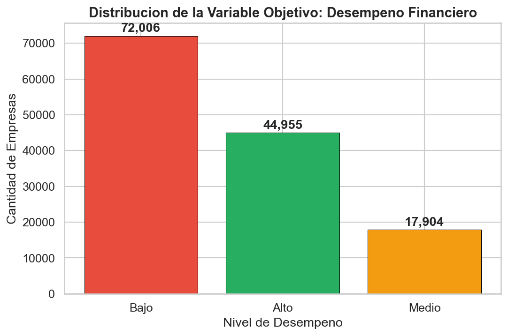

#### 2. Distribucion por Sector

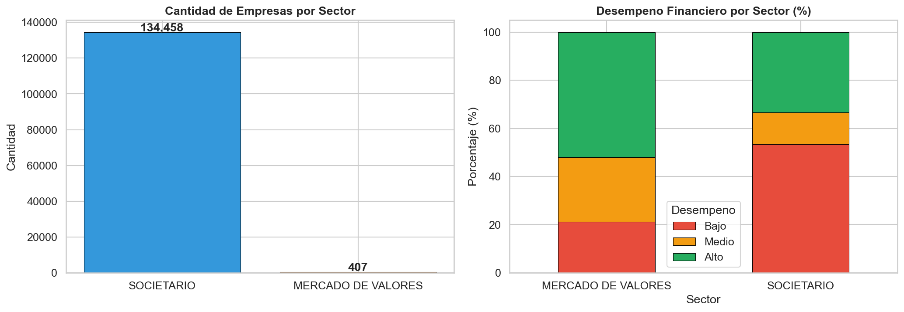

#### 3. Histogramas de Variables Financieras

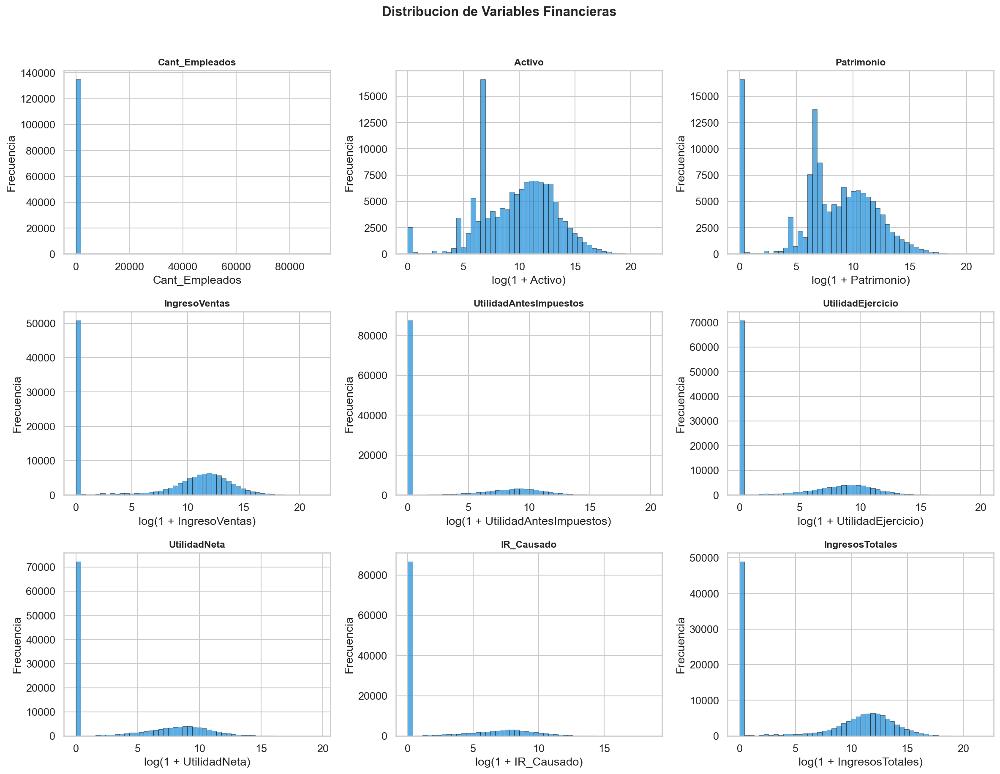

#### 4. Boxplots de Indicadores por Desempeno

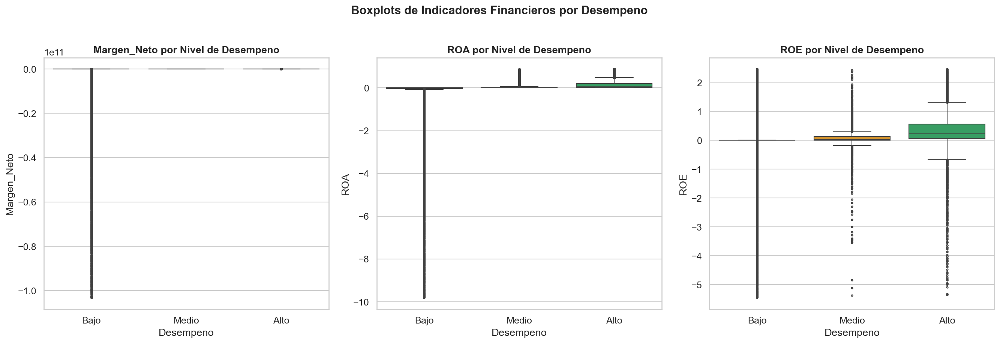

#### 5. Boxplots de Variables Financieras por Desempeno

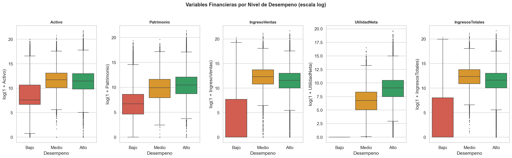

#### 6. Matriz de Correlacion

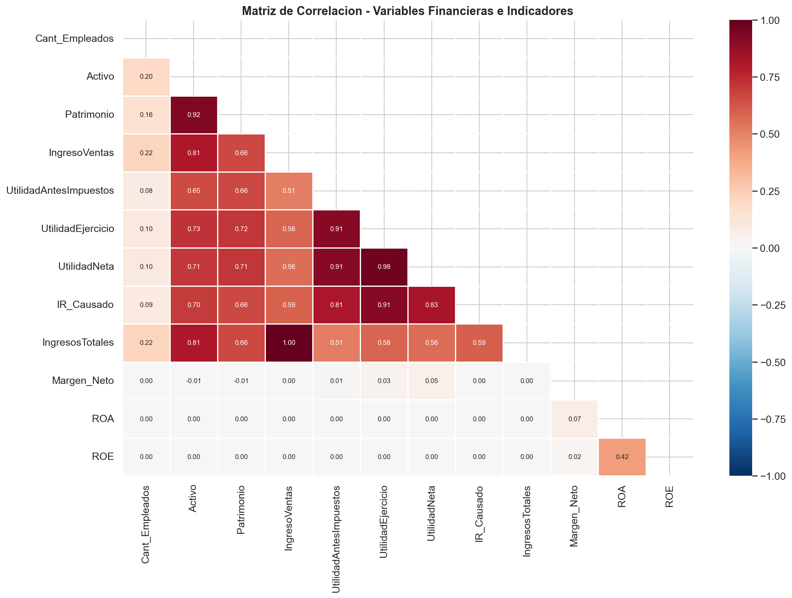

#### 7. Pairplot de Indicadores Clave

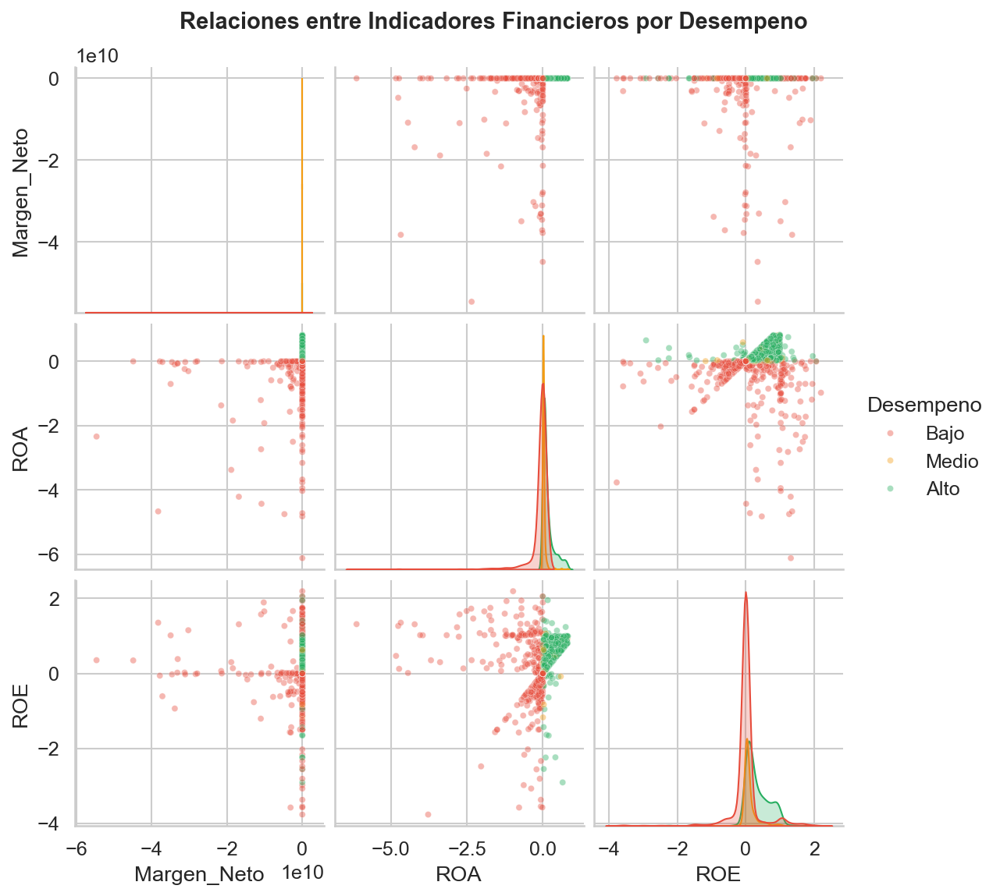

#### 8. Estadisticas Descriptivas por Clase

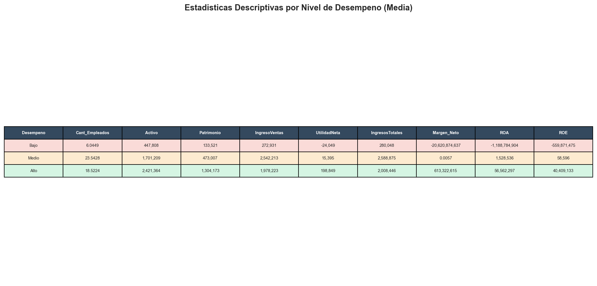

---

## Preprocesamiento de Datos

> Script: [`scr/2_PreProcesamiento.py`](scr/2_PreProcesamiento.py)

### Pasos Realizados

#### 1. Eliminacion de columna Año

Se elimino la columna **Año** del dataset ya que contiene un unico valor (2024) y no aporta poder predictivo al modelo. El dataset paso de 11 a **10 columnas**.

#### 2. Tratamiento de valores nulos

Se realizo un diagnostico completo de valores nulos en el dataset:

- **Nulos encontrados:** 0
- **Estrategia definida:** Mediana para variables numericas, moda para categoricas (aplicable si se detectaran nulos tras conversion de tipos)

#### 3. Codificacion de variables categoricas

Se aplico **LabelEncoder** a la variable categorica **Sector**:

| Valor Original | Codigo |
|---|---|
| MERCADO DE VALORES | 0 |
| SOCIETARIO | 1 |

Variable objetivo **Desempeno**:

| Nivel | Codigo |
|---|---|
| Alto | 0 |
| Bajo | 1 |
| Medio | 2 |

#### 4. Escalado de variables numericas

Se aplico **StandardScaler** (estandarizacion Z-score) a las 10 features del modelo, transformando cada variable para tener **media = 0** y **desviacion estandar = 1**.

Features escaladas:
`Sector`, `Cant_Empleados`, `Activo`, `Patrimonio`, `IngresoVentas`, `UtilidadAntesImpuestos`, `UtilidadEjercicio`, `UtilidadNeta`, `IR_Causado`, `IngresosTotales`

#### 5. Division en conjunto de entrenamiento y prueba (80/20)

Se realizo una division **estratificada** para mantener la proporcion de clases en ambos conjuntos:

| Conjunto | Registros | Porcentaje |
|---|---|---|
| Entrenamiento | 107,892 | 80% |
| Prueba | 26,973 | 20% |

Distribucion de clases (verificacion de estratificacion):

| Clase | Entrenamiento | Prueba |
|---|---|---|
| Bajo | 53.39% | 53.39% |
| Alto | 33.33% | 33.33% |
| Medio | 13.28% | 13.28% |

### Visualizaciones del Preprocesamiento

#### 9. Comparativa Antes/Despues del Escalado

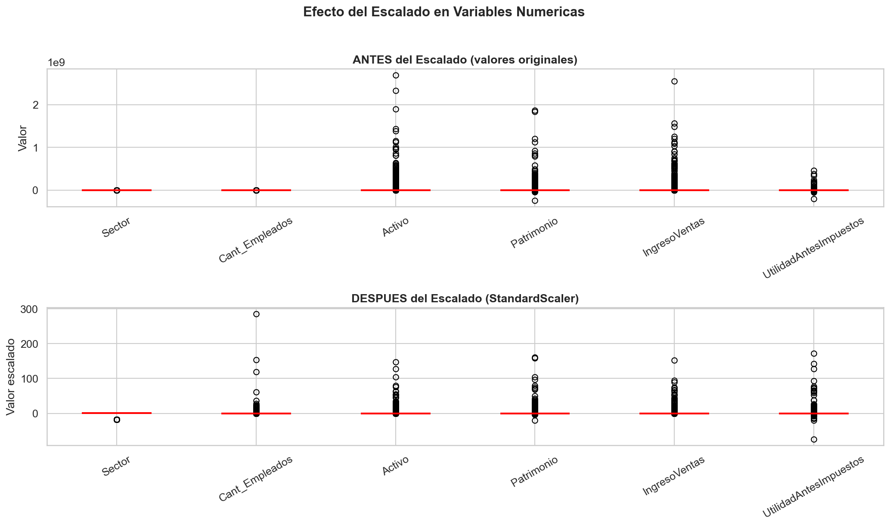

#### 10. Distribucion Train/Test por Clase

#### 11. Distribucion de Features Escaladas

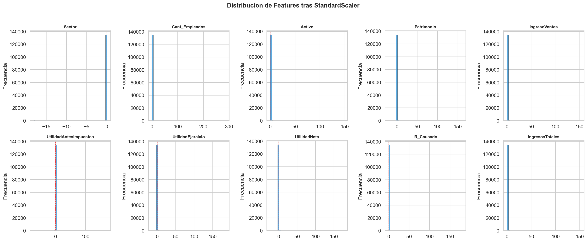

#### 12. Resumen del Preprocesamiento

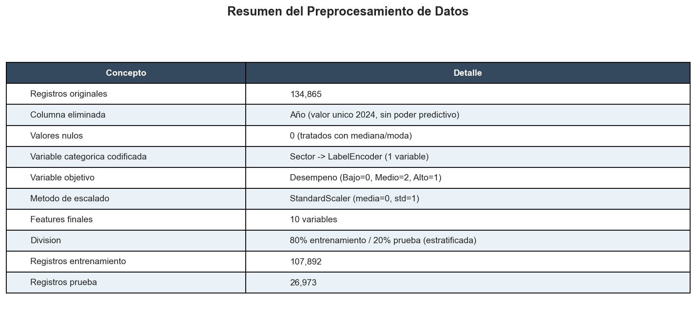

---

## Implementacion de Clasificadores

> Script: [`scr/3_EntrenarYEvaluar.py`](scr/3_EntrenarYEvaluar.py)

### Modelo 1: Arbol de Decision

Clasificador basado en particiones recursivas del espacio de features.

| Parametro | Valor |
|---|---|
| max_depth | 10 |
| min_samples_split | 20 |
| min_samples_leaf | 10 |
| class_weight | balanced |

**Resultados:**

| Metrica | Valor |
|---|---|
| Accuracy | 0.9778 |
| F1-Score (weighted) | 0.9782 |
| Precision (weighted) | 0.9794 |
| Recall (weighted) | 0.9778 |
| Tiempo de entrenamiento | 0.37s |

### Modelo 2: SVM (Support Vector Machine)

Se realizo **GridSearchCV** para encontrar la mejor combinacion de `kernel` y `C`:

| kernel | C | F1 (CV) |
|---|---|---|
| **linear** | **10.0** | **0.6724** |
| rbf | 10.0 | 0.6542 |
| linear | 1.0 | 0.5718 |
| rbf | 1.0 | 0.5586 |
| linear | 0.1 | 0.4790 |
| rbf | 0.1 | 0.4619 |

**Mejores hiperparametros:** `kernel=linear`, `C=10.0`

**Resultados:**

| Metrica | Valor |
|---|---|
| Accuracy | 0.7196 |
| F1-Score (weighted) | 0.6918 |
| Precision (weighted) | 0.7760 |
| Recall (weighted) | 0.7196 |
| Tiempo de entrenamiento | 31.72s |

> Nota: SVM fue entrenado con una muestra de 15,000 registros por su alto costo computacional. Su rendimiento inferior se debe a la complejidad no lineal de los datos financieros.

### Modelo 3: Random Forest

Ensamble de 200 arboles de decision con agregacion por votacion mayoritaria.

| Parametro | Valor |
|---|---|
| n_estimators | 200 |
| max_depth | 15 |
| min_samples_split | 10 |
| min_samples_leaf | 5 |
| class_weight | balanced |

**Resultados:**

| Metrica | Valor |
|---|---|
| Accuracy | 0.9931 |
| F1-Score (weighted) | 0.9931 |
| Precision (weighted) | 0.9931 |
| Recall (weighted) | 0.9931 |
| Tiempo de entrenamiento | 5.46s |

### Comparativa de Modelos

| Modelo | Accuracy | F1 (weighted) | Precision | Recall | Tiempo |
|---|---|---|---|---|---|
| Arbol de Decision | 0.9778 | 0.9782 | 0.9794 | 0.9778 | 0.37s |
| SVM | 0.7196 | 0.6918 | 0.7760 | 0.7196 | 31.72s |
| **Random Forest** | **0.9931** | **0.9931** | **0.9931** | **0.9931** | **5.46s** |

**Mejor modelo: Random Forest** con F1-Score de 0.9931. La feature mas importante es `UtilidadNeta` (importancia Gini = 0.3493).

### Visualizaciones de Entrenamiento y Evaluacion

#### 13. Matrices de Confusion Comparativa

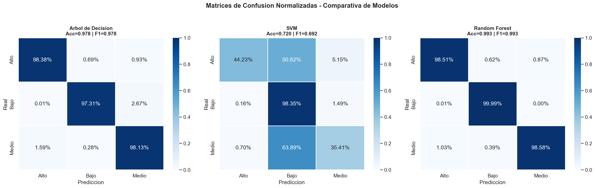

#### 14. Comparativa de Metricas

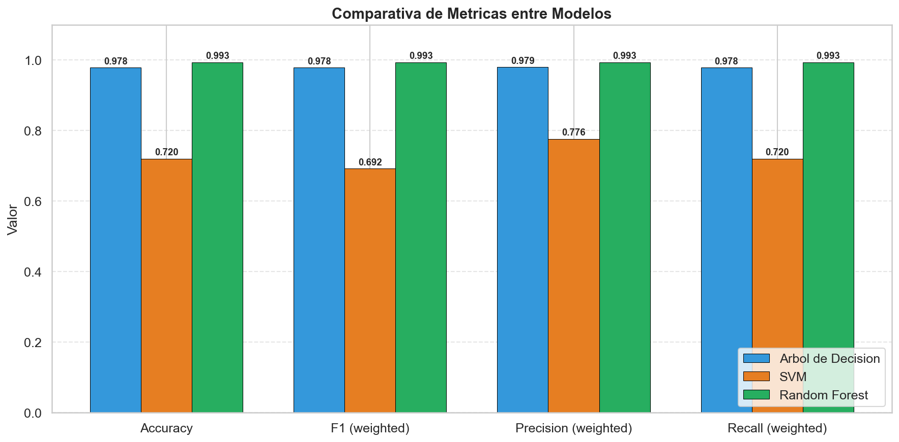

#### 15. Visualizacion del Arbol de Decision

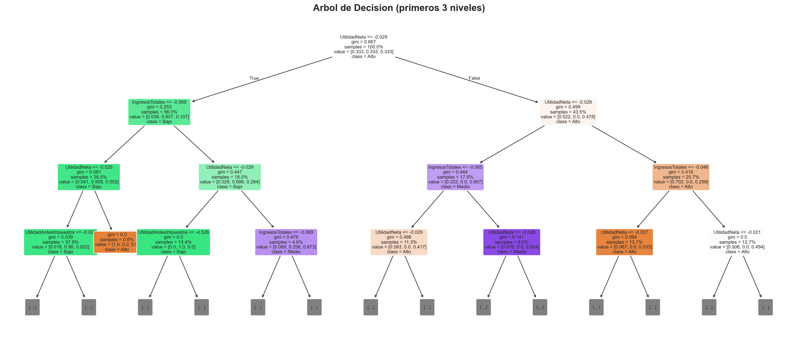

#### 16. Importancia de Features (Random Forest)

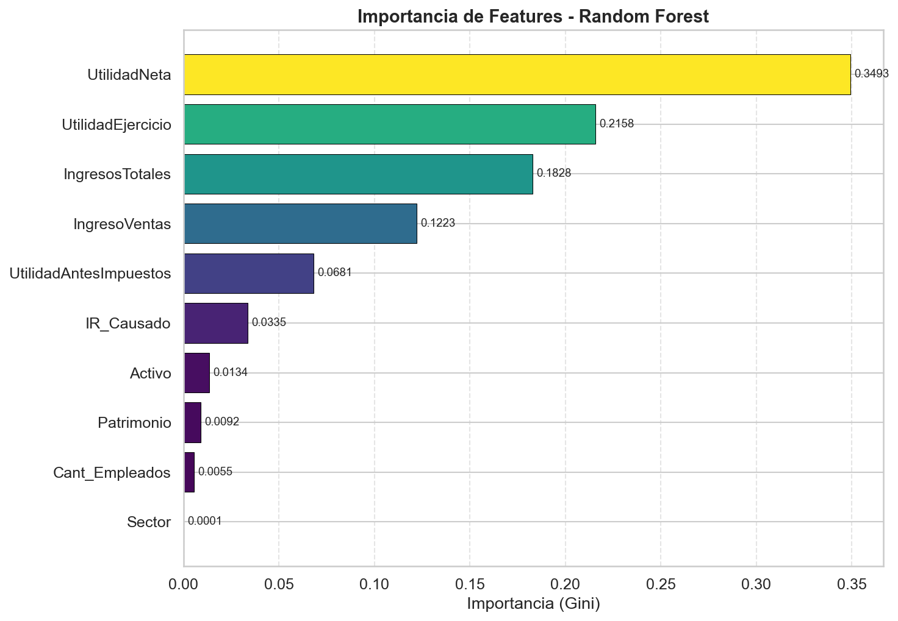

#### 17. GridSearchCV - SVM (Ajuste de Kernel y C)

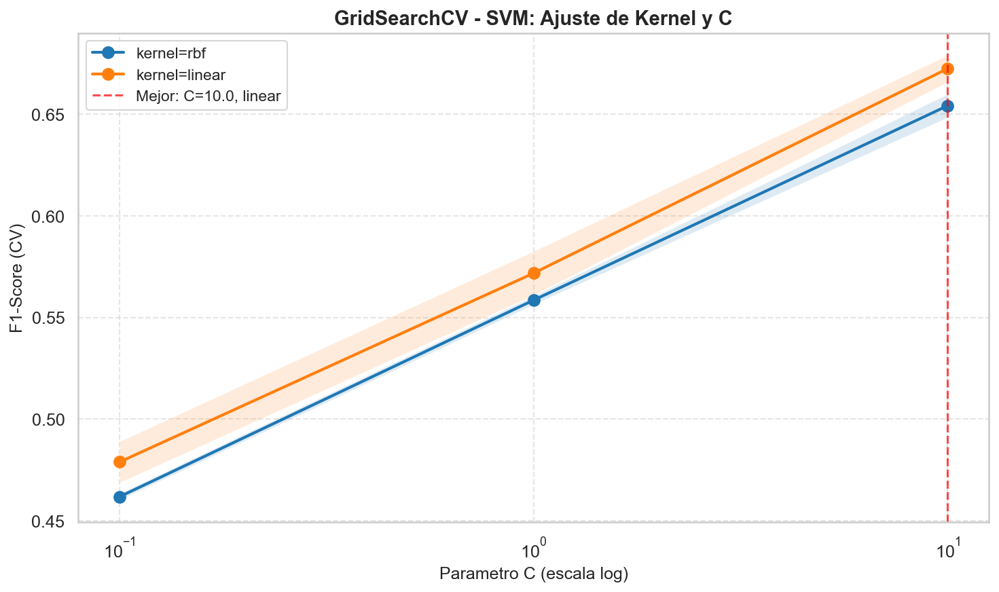

### Exportacion de Modelos

Los 3 modelos entrenados junto con los artefactos de preprocesamiento fueron exportados a la carpeta [`Models/`](Models/) usando `joblib` para permitir inferencia futura sin reentrenamiento:

| Archivo | Contenido |
|---|---|
| `arbol_decision.pkl` | Modelo Arbol de Decision entrenado |
| `svm.pkl` | Modelo SVM (linear, C=10) entrenado |
| `random_forest.pkl` | Modelo Random Forest entrenado |
| `scaler.pkl` | StandardScaler ajustado a los datos de entrenamiento |
| `label_encoder_target.pkl` | LabelEncoder de la variable objetivo (Alto/Bajo/Medio) |
| `label_encoder_sector.pkl` | LabelEncoder de la variable Sector |
| `feature_columns.pkl` | Lista ordenada de nombres de features |

---

## Comparacion Experimental

> Script: [`scr/4_ComparacionExperimental.py`](scr/4_ComparacionExperimental.py)

### Metricas Globales (weighted)

| Modelo | Accuracy | Precision | Recall | F1-Score | Tiempo |
|---|---|---|---|---|---|
| Arbol de Decision | 0.9778 | 0.9794 | 0.9778 | 0.9782 | 0.37s |
| SVM (linear, C=10) | 0.7196 | 0.7760 | 0.7196 | 0.6918 | 31.73s |
| **Random Forest** | **0.9931** | **0.9931** | **0.9931** | **0.9931** | **5.52s** |

### Metricas por Clase

| Modelo | Clase | Precision | Recall | F1-Score | Support |
|---|---|---|---|---|---|
| Arbol de Decision | Alto | 0.9934 | 0.9838 | 0.9885 | 8,991 |
| Arbol de Decision | Bajo | 0.9949 | 0.9731 | 0.9839 | 14,401 |
| Arbol de Decision | Medio | 0.8823 | 0.9813 | 0.9291 | 3,581 |
| SVM (linear, C=10) | Alto | 0.9881 | 0.4423 | 0.6111 | 8,991 |
| SVM (linear, C=10) | Bajo | 0.6744 | 0.9835 | 0.8001 | 14,401 |
| SVM (linear, C=10) | Medio | 0.6519 | 0.3541 | 0.4589 | 3,581 |
| **Random Forest** | **Alto** | **0.9957** | **0.9851** | **0.9904** | **8,991** |
| **Random Forest** | **Bajo** | **0.9952** | **0.9999** | **0.9975** | **14,401** |
| **Random Forest** | **Medio** | **0.9784** | **0.9858** | **0.9821** | **3,581** |

### Analisis de Resultados

- **Random Forest** es el mejor modelo con un F1-Score de 0.9931, logrando precision y recall superiores al 98% en las tres clases.
- **Arbol de Decision** obtiene resultados solidos (F1 = 0.9782), con su punto mas debil en la precision de la clase Medio (0.88).
- **SVM** presenta el rendimiento mas bajo (F1 = 0.6918), con dificultades especiales para clasificar las clases Alto (recall 0.44) y Medio (recall 0.35). Esto se debe a las limitaciones del modelo lineal con datos de alta complejidad y al uso de una muestra reducida por restricciones computacionales.

### Visualizaciones de la Comparacion

#### 18. Matrices de Confusion Detalladas (Absolutas y Normalizadas)

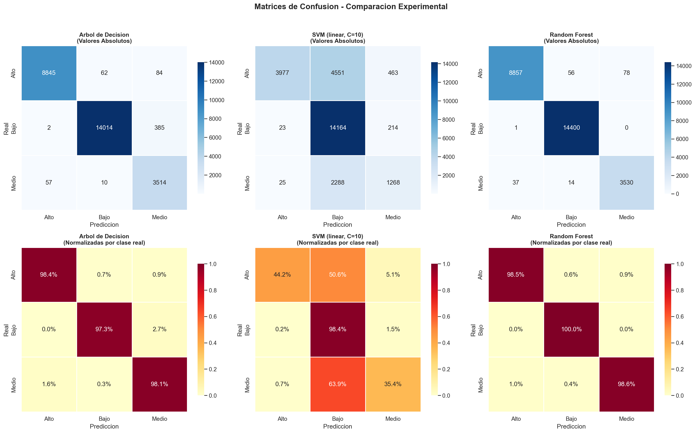

#### 19. Barplot de Metricas Globales

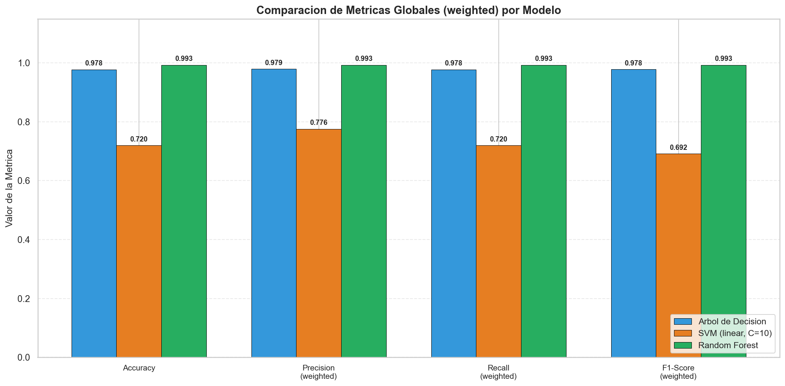

#### 20. Heatmap de Metricas por Clase

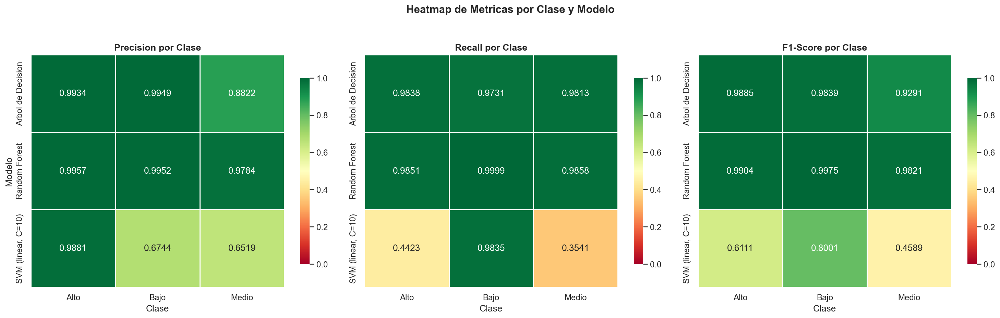

#### 21. F1-Score por Clase y Modelo

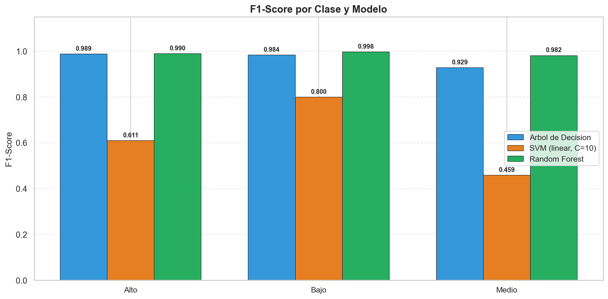

#### 22. Radar Comparativo de Modelos

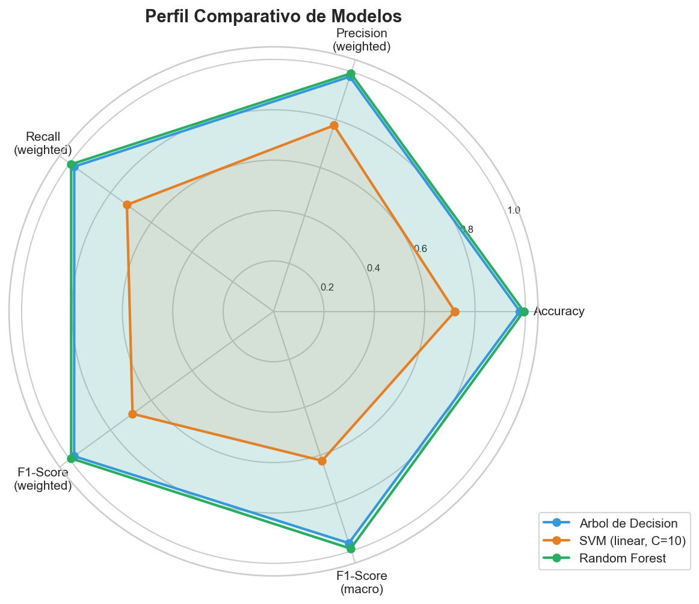

#### 23. Tabla Resumen de Comparacion

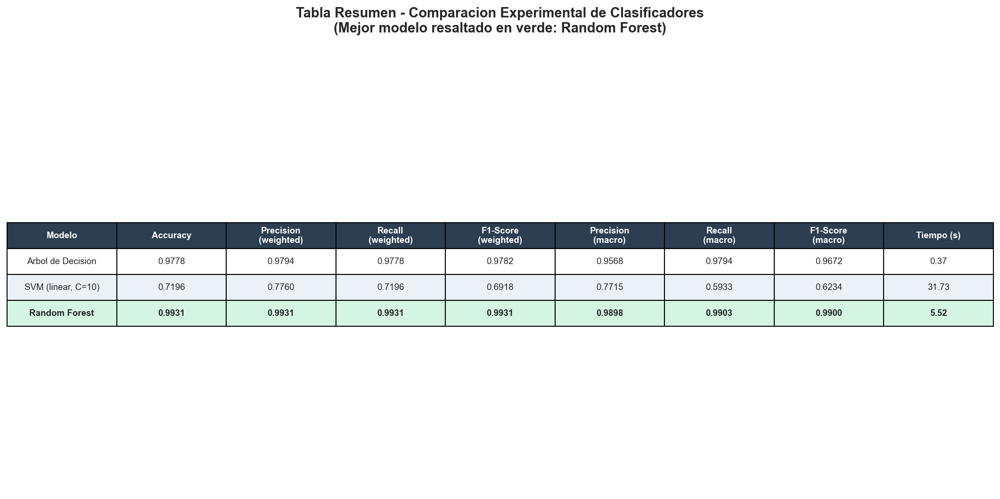

#### 24. Tabla de Metricas por Clase

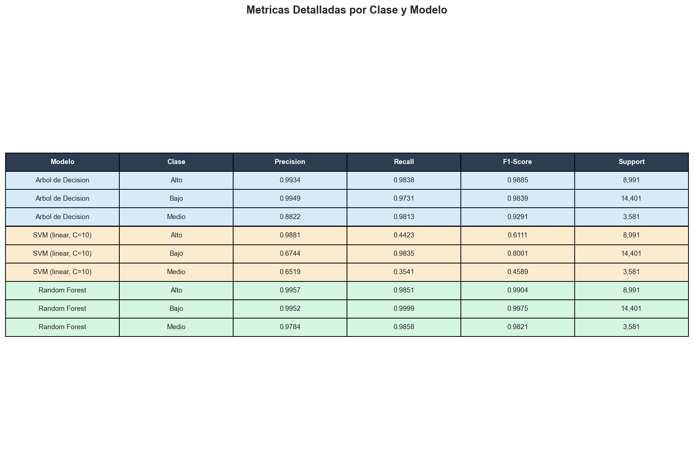

---

## Prueba de Modelos en Produccion

> Script: [`scr/5_ProbarModelosProduccion.py`](scr/5_ProbarModelosProduccion.py)
> Datos de prueba: [`Data/datos_prueba_produccion.json`](Data/datos_prueba_produccion.json)

### Descripcion

Se cargaron los 3 modelos exportados (`.pkl`) y se probaron con **10 empresas ficticias** definidas en un archivo JSON, cada una con un desempeno esperado (Alto, Medio o Bajo). El objetivo es evaluar la eficiencia y confiabilidad de cada modelo ante datos completamente nuevos.

### Empresas de Prueba

| ID | Empresa | Sector | Esperado |
|---|---|---|---|
| 1 | TechSolutions S.A. | SOCIETARIO | Alto |
| 2 | AgroExport Cia. Ltda. | SOCIETARIO | Medio |
| 3 | Constructora del Pacifico S.A. | SOCIETARIO | Alto |
| 4 | MiniMarket Express | SOCIETARIO | Bajo |
| 5 | Farmaceutica Nacional S.A. | SOCIETARIO | Alto |
| 6 | Taller Mecanico Hermanos Lopez | SOCIETARIO | Bajo |
| 7 | Valores del Litoral S.A. | MERCADO DE VALORES | Alto |
| 8 | Distribuidora Andina Cia. Ltda. | SOCIETARIO | Medio |
| 9 | Consultora Digital EC | SOCIETARIO | Medio |
| 10 | Pesquera del Sur S.A. | SOCIETARIO | Bajo |

### Informe de Eficiencia

| Modelo | Aciertos | Accuracy | Confianza Media | Confianza Min | Confianza Max |
|---|---|---|---|---|---|
| Arbol de Decision | 5/10 | 50.0% | 92.9% | 65.1% | 100.0% |
| SVM | 6/10 | 60.0% | 84.6% | 50.8% | 100.0% |
| **Random Forest** | **7/10** | **70.0%** | **97.3%** | **86.7%** | **100.0%** |

### Desglose por Clase

| Modelo | Alto (4 emp.) | Bajo (3 emp.) | Medio (3 emp.) |
|---|---|---|---|
| Arbol de Decision | 100% (4/4) | 33.3% (1/3) | 0% (0/3) |
| SVM | 100% (4/4) | 66.7% (2/3) | 0% (0/3) |
| **Random Forest** | **100% (4/4)** | **100% (3/3)** | **0% (0/3)** |

### Analisis de Confiabilidad

- **Clase Alto:** Los 3 modelos clasifican correctamente el 100% de las empresas de alto desempeno.
- **Clase Bajo:** Random Forest logra 100% de aciertos; Arbol de Decision confunde empresas pequenas con clase Medio.
- **Clase Medio:** Ningun modelo logra clasificar correctamente las empresas de desempeno medio en produccion, ya que todas fueron predichas como Alto. Esto sugiere que la clase Medio es la mas dificil de distinguir con datos nuevos y podria requerir features adicionales o un umbral de clasificacion ajustado.
- **Consenso unanime (3/3):** 4 de 10 empresas fueron clasificadas correctamente por los 3 modelos simultaneamente.
- **Modelo mas confiable:** Random Forest, con la mayor accuracy (70%) y la confianza media mas alta (97.3%).

### Visualizaciones de Produccion

#### 25. Accuracy por Modelo en Produccion

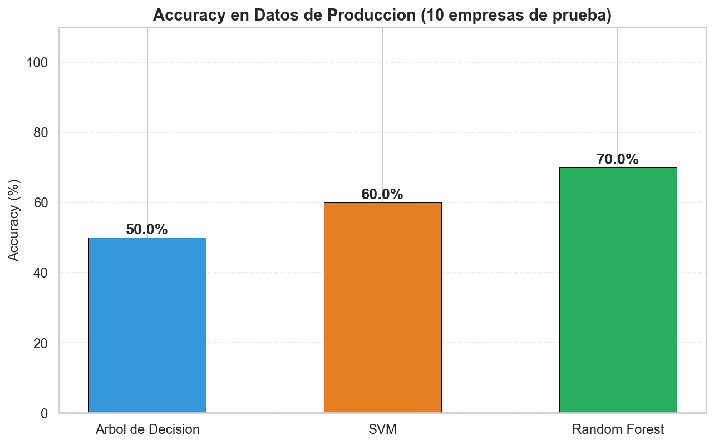

#### 26. Radar de Confiabilidad por Modelo

Grafico radar con 6 dimensiones (Accuracy General, Confianza Media, Confianza Minima, Accuracy por clase Alto, Bajo y Medio) que permite comparar visualmente el perfil de confiabilidad de cada modelo.

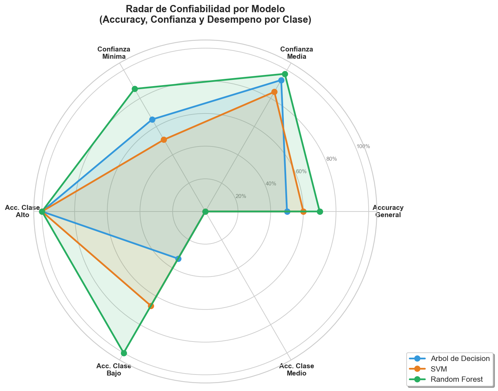

#### 27. Radar de Confianza por Empresa

Panel de 10 graficos radar individuales (uno por empresa), mostrando la confianza de cada modelo. Los puntos verdes indican aciertos y los rojos indican fallos.

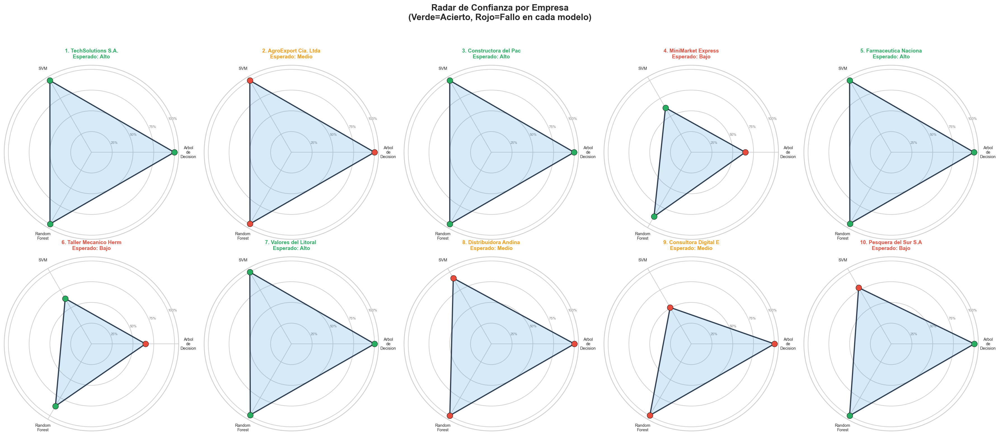

#### 28. Heatmap de Predicciones por Empresa

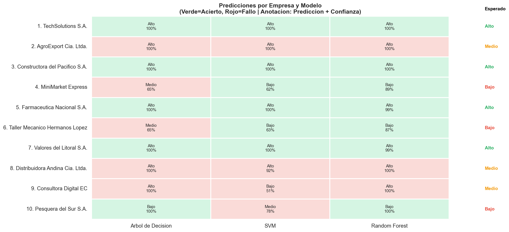

#### 29. Accuracy por Clase en Produccion

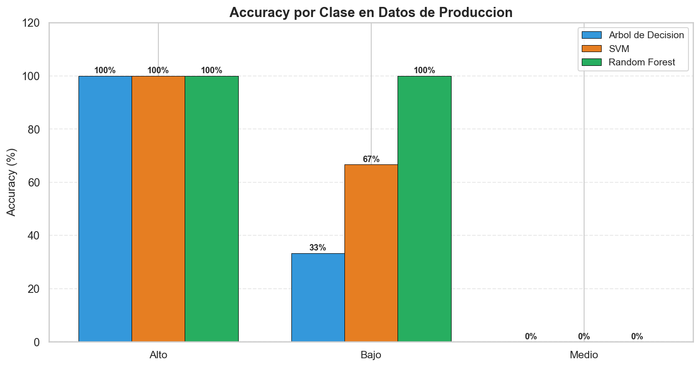

#### 30. Radar Resumen Ejecutivo

Grafico radar con 5 dimensiones (Accuracy General, Confianza Media, Confianza Minima, Consistencia, Accuracy Clase Mayoritaria) que resume la eficiencia vs confiabilidad de cada modelo.

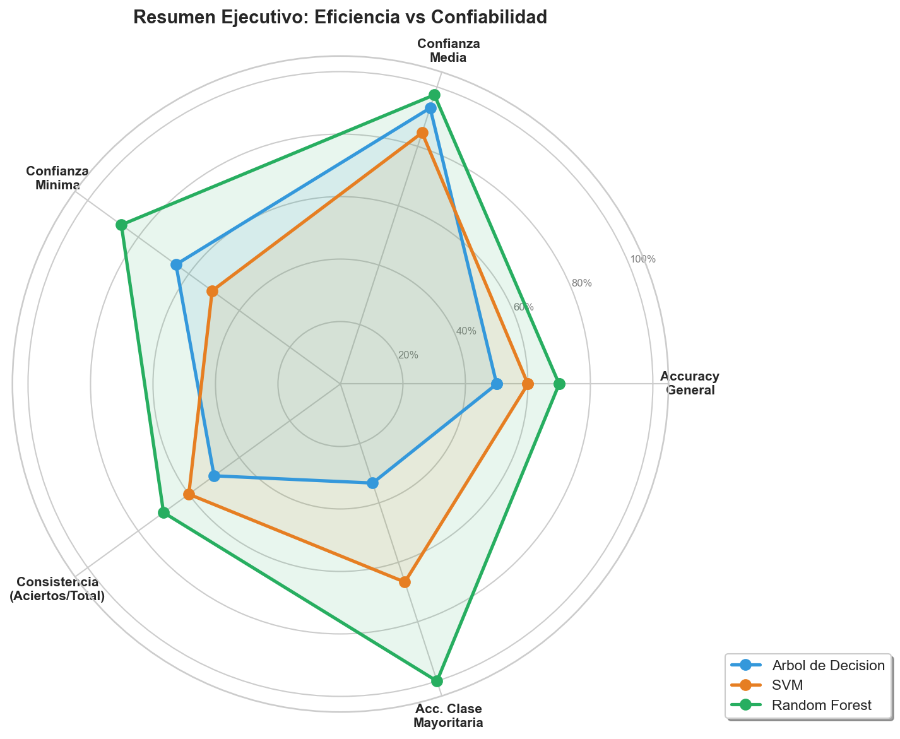

#### 31. Informe Completo de Produccion

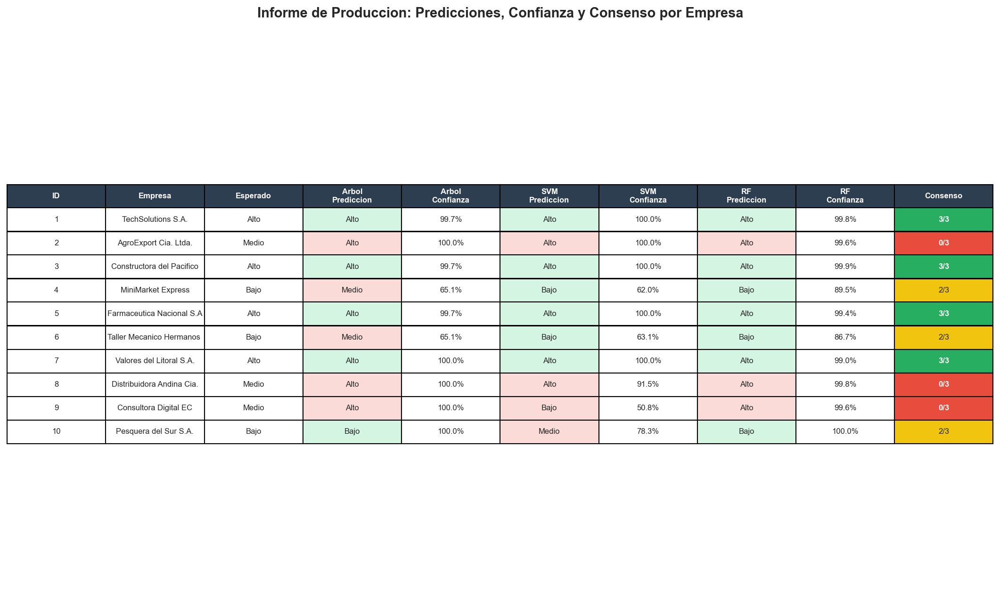
